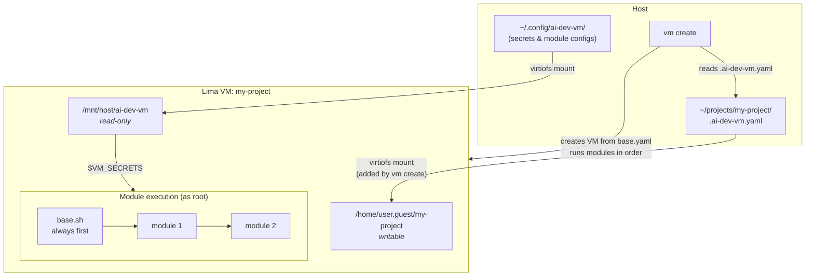

# AI Dev VM

Modular Linux VM environment for AI-assisted development on macOS via [Lima](https://lima-vm.io/).

Each project gets an isolated VM with only the tools it needs. Modules are selected per-project via a `.ai-dev-vm.yaml` config file, and the whole lifecycle is driven by the `vm` command.

## Prerequisites

```bash
brew install lima yq
```

## Install

From the cloned repo:

```bash
./install.sh
```

## Quick Start

```bash
cd ~/projects/my-project
vm init
# edit .ai-dev-vm.yaml
vm create
vm shell
```

Run inside a project directory (one containing `.ai-dev-vm.yaml`) and `vm` uses that project automatically — the VM name is the directory's basename. You can also target any VM by name from anywhere, e.g. `vm shell my-project`.

## Commands

| Command | Description |
|---------|-------------|
| `vm init [path]` | Write a commented `.ai-dev-vm.yaml` template (default: current dir). `--force` overwrites. |
| `vm create [path]` | Create + start a VM from a project dir (default: current dir). |
| `vm list` | List all Lima VMs. |
| `vm shell [name]` | Open a shell in the VM. |
| `vm start [name]` | Start a stopped VM. |
| `vm stop [name]` | Stop a running VM. |
| `vm restart [name]` | Restart a VM. |
| `vm delete [name]` | Stop and delete a VM. `--force` skips the confirmation. |

`[name]` defaults to the current project; `[path]` defaults to the current directory.

To connect from VS Code: Remote-SSH → `lima-<name>`.

Git inside the VM: commit, diff, log, branch, rebase — all local. Git on the host: push, pull, fetch — where credentials live.

To change a VM's resources or modules, re-create it: `vm delete <name>` then `vm create`.

## How It Works



`vm create` does the following:

1. Reads `.ai-dev-vm.yaml` from the project root to get the list of modules
2. Creates a Lima VM from `base.yaml` and adds a writable mount for the project directory
3. Runs `base.sh` (always), then each module from the config in order

Each module runs as root with these environment variables:

| Variable | Value | Description |
|----------|-------|-------------|
| `VM_USER` | auto-detected | Unprivileged user in the VM |
| `VM_PROJECT` | project name | Used in paths |
| `VM_SECRETS` | `/mnt/host/ai-dev-vm` | Read-only mount of `~/.config/ai-dev-vm` |

Module-specific configs go in `~/.config/ai-dev-vm/modules/<name>/` on the host and are accessible inside modules at `$VM_SECRETS/modules/<name>/`.

## Project Config

`.ai-dev-vm.yaml` selects modules and, optionally, VM resources:

```yaml
modules:
  - node
  - docker
  - claude
resources:
  cpus: 8        # default: 4
  memory: 16GiB  # default: 4GiB
  disk: 200GiB   # default: 120GiB
```

Each `resources` field is optional; omitted fields keep the default. Values pass straight to Lima, so use Lima's formats (a plain integer for `cpus`, a size string like `16GiB` for `memory`/`disk`).

## Modules

| Module | Description |
|--------|-------------|
| `node` | Node.js (latest LTS) + npm + pnpm + yarn |
| `dotnet` | .NET SDK (latest LTS) |
| `docker` | Docker CE |
| `claude` | Claude Code CLI |

The `base` module (git, curl, jq, ripgrep, fd, build-essential) is always installed automatically.

## Custom CA Certificates

If your network uses SSL inspection (corporate proxy), place root CA certificates in PEM format into:

```bash
mkdir -p ~/.config/ai-dev-vm/ca-certificates
cp your-corp-ca.pem ~/.config/ai-dev-vm/ca-certificates/
```

`base.sh` installs them into the VM's system trust store before other modules run.

## Module Configuration

### claude

Create `~/.config/ai-dev-vm/modules/claude/settings.json` with your Claude Code settings:

```json
{
  "apiKey": "your-key-here"
}
```

Claude Code reads this file automatically on startup.

To pre-install plugins, create `~/.config/ai-dev-vm/modules/claude/plugins` with one plugin name per line:

```
superpowers
```

Lines starting with `#` are ignored.

## Adding a Module

Create `modules/<name>.sh` following the module contract:

```bash
#!/usr/bin/env bash
set -euo pipefail
# Runs as root, DEBIAN_FRONTEND=noninteractive
# Available env vars: VM_USER, VM_PROJECT, VM_SECRETS
```

Then use `<name>` in `.ai-dev-vm.yaml`.

Module config files (if needed) go in `~/.config/ai-dev-vm/modules/<name>/` on the host, accessible inside the module at `$VM_SECRETS/modules/<name>/`.

## Security

- Each project is isolated in its own VM
- Secrets mounted read-only from host, loaded only in subshells
- Git credentials stay on host — no duplication
- SSH agent forwarding disabled
