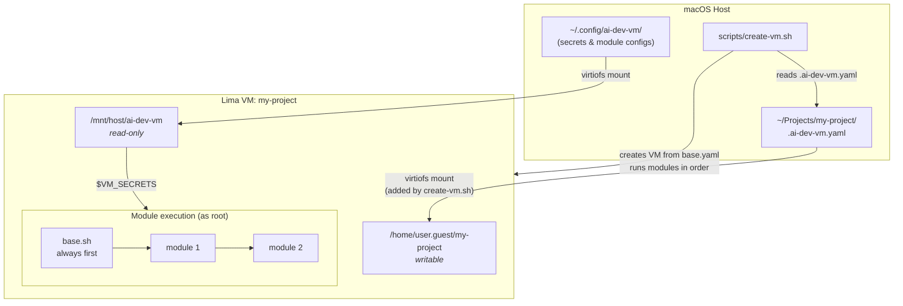

# AI Dev VM

Modular Linux VM environment for AI-assisted development on macOS via [Lima](https://lima-vm.io/).

Each project gets an isolated VM with only the tools it needs. Modules are selected per-project via a `.ai-dev-vm.yaml` config file.

## Prerequisites

```bash
brew install lima yq
```

## Setup

Create a local config directory (not committed to git):

```bash
mkdir -p ~/.config/ai-dev-vm
chmod 700 ~/.config/ai-dev-vm
cp ~/.gitconfig ~/.config/ai-dev-vm/.gitconfig
```

## How It Works



`create-vm.sh` does the following:

1. Reads `.ai-dev-vm.yaml` from the project root to get the list of modules
2. Creates a Lima VM from `base.yaml` and adds a writable mount for the project directory
3. Runs `base.sh` (always), then each module from the config in order

Each module runs as root with these environment variables:

| Variable | Value | Description |
|----------|-------|-------------|
| `VM_USER` | auto-detected | Unprivileged user in the VM |
| `VM_PROJECT` | project name | Used in paths |
| `VM_SECRETS` | `/mnt/host/ai-dev-vm` | Read-only mount of `~/.config/ai-dev-vm` |

Module-specific configs go in `~/.config/ai-dev-vm/modules/<name>/` on the host and are accessible inside modules at `$VM_SECRETS/modules/<name>/`.

## Usage

### 1. Add config to your project

Create `.ai-dev-vm.yaml` in the project root:

```yaml
modules:
  - node
  - docker
  - claude
```

### 2. Create a VM

```bash
./scripts/create-vm.sh my-project
# or with explicit path:
./scripts/create-vm.sh my-project ~/Work/my-project
```

### 3. List VMs

```bash
limactl list
```

### 4. Connect

```bash
limactl shell my-project
# or
ssh lima-my-project
```

VS Code: Remote-SSH → `lima-my-project`

### 5. Work

```bash
cd ~/my-project
claude
```

Git inside VM: commit, diff, log, branch, rebase — all local operations.
Git on host: push, pull, fetch — where credentials are configured.

### 6. Delete when done

```bash
./scripts/delete-vm.sh my-project
```

### Update

Re-create instead of updating:

```bash
./scripts/delete-vm.sh my-project
./scripts/create-vm.sh my-project
```

## Modules

| Module | Description |
|--------|-------------|
| `node` | Node.js (latest LTS) + npm + pnpm + yarn |
| `dotnet` | .NET SDK (latest LTS) |
| `docker` | Docker CE |
| `claude` | Claude Code CLI |

`base` module (git, curl, jq, ripgrep, fd, build-essential) is always installed automatically.

## Custom CA Certificates

If your network uses SSL inspection (corporate proxy), place root CA certificates in PEM format into:

```bash
mkdir -p ~/.config/ai-dev-vm/ca-certificates
cp your-corp-ca.pem ~/.config/ai-dev-vm/ca-certificates/
```

`base.sh` installs them into the VM's system trust store before other modules run.

## Module Configuration

### claude

Create `~/.config/ai-dev-vm/modules/claude/settings.json` with your Claude Code settings:

```json
{
  "apiKey": "your-key-here"
}
```

Claude Code reads this file automatically on startup.

To pre-install plugins, create `~/.config/ai-dev-vm/modules/claude/plugins` with one plugin name per line:

```
superpowers
```

Lines starting with `#` are ignored.

## Adding a Module

Create `modules/<name>.sh` following the module contract:

```bash
#!/usr/bin/env bash
set -euo pipefail
# Runs as root, DEBIAN_FRONTEND=noninteractive
# Available env vars: VM_USER, VM_PROJECT, VM_SECRETS
```

Then use `<name>` in `.ai-dev-vm.yaml`.

Module config files (if needed) go in `~/.config/ai-dev-vm/modules/<name>/` on the host, accessible inside the module at `$VM_SECRETS/modules/<name>/`.

## Security

- Each project is isolated in its own VM
- Secrets mounted read-only from host, loaded only in subshells
- Git credentials stay on macOS — no duplication
- SSH agent forwarding disabled
